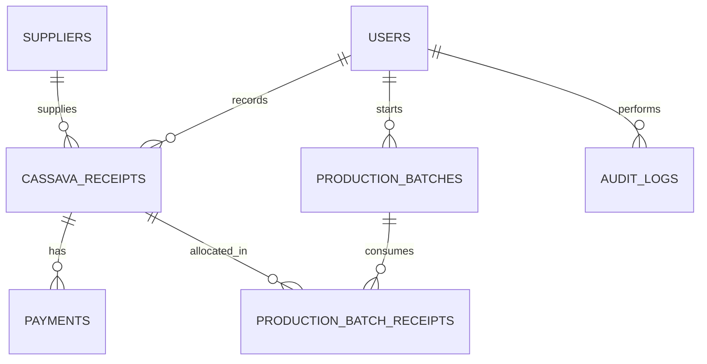

# PRD / SRS — Cassava Receiving System
### CV TapioLeaf Management System — Margoyoso, Pati, Central Java

| | |
|---|---|
| **Module** | Cassava Receiving System (Penerimaan Singkong) |
| **System** | CV TapioLeaf Management System |
| **Tech Stack** | SvelteKit (frontend + backend), Prisma ORM, PostgreSQL (NeonDB), Zod, shadcn-svelte |
| **Status** | Draft v1.1 |
| **Revision** | v1.1 — added unloading fee deduction (*potongan bongkar*) |

> **Note on adjustments from the original request:** the original spec listed `React components` and `shadcn/ui`. Since the project's actual stack is **SvelteKit** (not React/Next.js), this document uses **Svelte components** and **shadcn-svelte** (the Svelte port of shadcn/ui) instead — these are functionally equivalent but match the codebase already in place. Prisma, Zod, soft deletes, and audit logging have also been added to stay consistent with the architectural patterns already used elsewhere in the system (RBAC, HTTP-only session cookies, atomic transactions, event-sourcing-style stock movements).

---

## 1. Document Overview

This document specifies the **Cassava Receiving System**, the module responsible for recording raw cassava deliveries from suppliers, calculating receiving weights and supplier payments, and feeding accepted cassava into the production pipeline. It follows the same 20-section structure used for the other feature PRDs in this project (Authentication, Dashboard, Product Management, Warehouse Stock, Daily Production).

## 2. Background & Context

CV TapioLeaf processes raw cassava into tapioca flour. Before production can begin, cassava delivered by external suppliers must be weighed, inspected for impurities/spoilage (*rafaksi* — refraction), and priced. This module digitizes a process that is currently done manually on paper weighbridge slips, which causes calculation errors, delayed supplier payments, and no traceability between a specific delivery and the production batch it was used in.

## 3. Goals & Objectives

- Replace manual, paper-based cassava receiving slips with a digital, auditable record.
- Eliminate manual calculation errors for net weight, final weight, and total cost.
- Give the Owner real-time visibility into daily intake volume and outstanding supplier payments.
- Create a traceable link between a cassava delivery and the production batch(es) it was consumed in.

## 4. Scope

**In scope**
- Supplier CRUD
- Cassava receipt CRUD with automatic weight/cost calculation
- Validation of weight and price business rules
- Production batch creation and allocation of receipts to batches
- Daily and per-supplier reporting
- Role-based access aligned with existing system roles
- Audit logging of create/update/delete actions

**Out of scope (see §20 — Future Scalability)**
- QR-code-based receipt printing/scanning
- PDF/Excel export
- Direct weighbridge hardware integration
- Stock forecasting / ML-based demand prediction
- Dedicated mobile app
- New roles beyond the 5 already defined

## 5. User Roles & Permissions

The module reuses the system's existing 5 roles. Suggested permission matrix:

| Action | Owner | Petugas Gudang | Bagian Produksi | Admin Penjualan | Pembeli UMKM |
|---|---|---|---|---|---|
| Manage suppliers | ✅ | ✅ | ❌ | View only | ❌ |
| Create cassava receipt | ✅ | ✅ | ❌ | ❌ | ❌ |
| Edit/void cassava receipt | ✅ | ✅ (same-day only) | ❌ | ❌ | ❌ |
| Mark receipt as paid | ✅ | ❌ | ❌ | View only | ❌ |
| Create production batch | ✅ | ❌ | ✅ | ❌ | ❌ |
| Allocate receipts to batch | ✅ | ❌ | ✅ | ❌ | ❌ |
| View daily/supplier reports | ✅ | ✅ | View only | View only | ❌ |

> Payment confirmation is assigned to **Owner** by default since there is no dedicated finance role yet. This can be reassigned later without schema changes — `Payment` is its own model, not hardcoded to a role.

## 6. Functional Requirements

### 6.1 Supplier Management
- Create, read, update, soft-delete suppliers.
- List view with search (by name/phone) and pagination.
- Prevent deletion if supplier has linked receipts — soft delete (`isActive = false`) only.

### 6.2 Cassava Receipt Management
- Record a new delivery against a selected supplier.
- Auto-calculate `netWeight`, `finalWeight`, `totalCost` live in the form and again authoritatively on the server before persisting (client values are never trusted).
- Edit a receipt (restricted by role/time window — see §5).
- Soft-delete (void) a receipt, never hard-delete, to preserve the audit trail.
- Record `unloadingFeePerKg` (potongan bongkar per kg) at intake; the system computes `unloadingFee` and the resulting `netPayment` — the actual amount owed to the supplier after the unloading deduction.
- Track `paymentStatus` (`UNPAID` / `PARTIAL` / `PAID`) and link to a `Payment` history. `paymentStatus`/`Payment.amount` are tracked against `netPayment`, not `totalCost` — the unloading fee is deducted before the supplier is owed anything.

### 6.3 Production Batch Integration
- Create a production batch (date, notes, status).
- Allocate one or more cassava receipts to a batch, specifying how many kg of each receipt were consumed (`ProductionBatchReceipt`), so a single receipt can be split across batches and a batch can draw from multiple receipts.
- Record `tapiocaProducedKg` and `wasteGeneratedKg`; system computes `yieldPercentage`.
- Prevent allocating more kg from a receipt than its remaining unallocated `finalWeight`.

### 6.4 Reporting
- **Daily report:** total cassava received (sum of `finalWeight`), total refraction, total supplier payments, for a selected date or date range.
- **Supplier report:** delivery count, total supplied weight, and payment history for a selected supplier.

## 7. Business Rules & Calculation Logic

```
netWeight    = grossWeight - taraWeight
finalWeight  = netWeight - refraction
totalCost    = finalWeight × pricePerKg
unloadingFee = finalWeight × unloadingFeePerKg
netPayment   = totalCost - unloadingFee
yieldPercentage = (tapiocaProducedKg / cassavaUsedKg) × 100
```

`netPayment` is the amount actually owed to the supplier — `totalCost` is the gross value of the cassava before the unloading deduction (*potongan bongkar*) is taken out.

All four weight/cost values are **recomputed server-side** on every create/update request, regardless of what the client sends — the client-side live calculation is for UX only.

## 8. Validation Rules

| Field | Rule |
|---|---|
| `grossWeight` | required, > 0 |
| `taraWeight` | required, ≥ 0, **≤ grossWeight** |
| `refraction` | required, ≥ 0, **≤ netWeight** |
| `pricePerKg` | required, ≥ 0 |
| `unloadingFeePerKg` | required, ≥ 0, **≤ pricePerKg** (net payment cannot go negative) |
| `supplierId` | required, must reference an active supplier |
| `vehicleNumber` | required, non-empty |
| `receiptDate` | required, cannot be a future date |

```ts
// lib/validation/cassava-receipt.schema.ts
import { z } from 'zod';

export const cassavaReceiptSchema = z.object({
  receiptDate: z.coerce.date().max(new Date(), 'Receipt date cannot be in the future'),
  supplierId: z.string().uuid(),
  vehicleNumber: z.string().min(1, 'Vehicle number is required'),
  driverName: z.string().optional(),
  grossWeight: z.coerce.number().positive('Gross weight must be greater than 0'),
  taraWeight: z.coerce.number().nonnegative(),
  refraction: z.coerce.number().nonnegative(),
  pricePerKg: z.coerce.number().nonnegative(),
  unloadingFeePerKg: z.coerce.number().nonnegative(),
  notes: z.string().max(500).optional(),
}).superRefine((data, ctx) => {
  if (data.taraWeight > data.grossWeight) {
    ctx.addIssue({
      code: z.ZodIssueCode.custom,
      message: 'Tara weight cannot exceed gross weight',
      path: ['taraWeight'],
    });
  }
  const netWeight = data.grossWeight - data.taraWeight;
  if (data.refraction > netWeight) {
    ctx.addIssue({
      code: z.ZodIssueCode.custom,
      message: 'Refraction cannot exceed net weight',
      path: ['refraction'],
    });
  }
  if (data.unloadingFeePerKg > data.pricePerKg) {
    ctx.addIssue({
      code: z.ZodIssueCode.custom,
      message: 'Unloading fee per kg cannot exceed price per kg',
      path: ['unloadingFeePerKg'],
    });
  }
});

export type CassavaReceiptInput = z.infer<typeof cassavaReceiptSchema>;
```

## 9. Non-Functional Requirements

- **Performance:** receipts list and reports must paginate server-side; `receiptDate` and `supplierId` are indexed.
- **Data integrity:** receipt creation + audit log write happen in a single Prisma `$transaction`; batch allocation + remaining-weight check are also atomic to prevent over-allocation under concurrent requests.
- **Auditability:** every create/update/void on `CassavaReceipt`, `Payment`, and `ProductionBatchReceipt` writes an `AuditLog` row.
- **Security:** all `/api/*` routes enforce RBAC via the existing session/role middleware; mutations require CSRF-safe POST/PATCH/DELETE with HTTP-only session cookies (already established in the Authentication module).

## 10. Data Model — Prisma Schema

Fields marked **(core)** come directly from the original request. Fields marked **(extended)** are additions needed to satisfy the reporting, payment-history, and audit requirements — flagged here so they're easy to drop if out of scope for your thesis defense.

```prisma
model Supplier {
  id           String   @id @default(uuid())
  supplierName String                       // core
  phone        String                       // core
  address      String                       // core
  isActive     Boolean  @default(true)      // extended — enables soft delete
  createdAt    DateTime @default(now())     // core
  updatedAt    DateTime @updatedAt           // core
  deletedAt    DateTime?                    // extended

  receipts     CassavaReceipt[]

  @@map("suppliers")
}

enum PaymentStatus {
  UNPAID
  PARTIAL
  PAID
}

model CassavaReceipt {
  id            String        @id @default(uuid())
  receiptNumber String        @unique          // extended — human-readable reference
  receiptDate   DateTime                        // core
  supplierId    String                          // core
  supplier      Supplier      @relation(fields: [supplierId], references: [id])
  vehicleNumber String                          // core
  driverName    String?                         // extended
  grossWeight   Decimal       @db.Decimal(10, 2) // core
  taraWeight    Decimal       @db.Decimal(10, 2) // core
  netWeight     Decimal       @db.Decimal(10, 2) // core
  refraction    Decimal       @db.Decimal(10, 2) // core
  finalWeight   Decimal       @db.Decimal(10, 2) // core
  pricePerKg    Decimal       @db.Decimal(10, 2) // core
  totalCost     Decimal       @db.Decimal(12, 2) // core
  unloadingFeePerKg Decimal   @db.Decimal(10, 2) @default(0) // extended — potongan bongkar rate
  unloadingFee      Decimal   @db.Decimal(12, 2) @default(0) // extended — finalWeight × unloadingFeePerKg
  netPayment        Decimal   @db.Decimal(12, 2)              // extended — totalCost − unloadingFee, amount owed to supplier
  paymentStatus PaymentStatus @default(UNPAID)   // extended
  notes         String?                          // core
  receivedById  String                           // extended — audit trail
  receivedBy    User          @relation(fields: [receivedById], references: [id])
  createdAt     DateTime      @default(now())    // core
  updatedAt     DateTime      @updatedAt           // core
  deletedAt     DateTime?                         // extended

  batchAllocations ProductionBatchReceipt[]
  payments         Payment[]

  @@map("cassava_receipts")
  @@index([supplierId])
  @@index([receiptDate])
}

enum BatchStatus {
  IN_PROGRESS
  COMPLETED
  CANCELLED
}

model ProductionBatch {
  id                String      @id @default(uuid())
  batchNumber       String      @unique
  productionDate    DateTime
  cassavaUsedKg     Decimal     @db.Decimal(10, 2)
  tapiocaProducedKg Decimal     @db.Decimal(10, 2)
  wasteGeneratedKg  Decimal     @db.Decimal(10, 2)
  yieldPercentage   Decimal     @db.Decimal(5, 2)
  status            BatchStatus @default(IN_PROGRESS)
  notes             String?
  startedById       String
  startedBy         User        @relation(fields: [startedById], references: [id])
  createdAt         DateTime    @default(now())
  updatedAt         DateTime    @updatedAt
  deletedAt         DateTime?

  receiptAllocations ProductionBatchReceipt[]

  @@map("production_batches")
}

// Junction table resolving the many-to-many relationship between
// cassava_receipts and production_batches
model ProductionBatchReceipt {
  id                String   @id @default(uuid())
  productionBatchId String
  cassavaReceiptId  String
  quantityUsedKg    Decimal  @db.Decimal(10, 2)

  productionBatch ProductionBatch @relation(fields: [productionBatchId], references: [id])
  cassavaReceipt  CassavaReceipt  @relation(fields: [cassavaReceiptId], references: [id])

  @@map("production_batch_receipts")
  @@unique([productionBatchId, cassavaReceiptId])
}

model Payment {
  id               String   @id @default(uuid())
  cassavaReceiptId String
  cassavaReceipt   CassavaReceipt @relation(fields: [cassavaReceiptId], references: [id])
  amount           Decimal  @db.Decimal(12, 2)
  paymentDate      DateTime
  paymentMethod    String?
  notes            String?
  createdAt        DateTime @default(now())

  @@map("payments")
}

model AuditLog {
  id         String   @id @default(uuid())
  userId     String
  user       User     @relation(fields: [userId], references: [id])
  action     String
  entityType String
  entityId   String
  oldValue   Json?
  newValue   Json?
  createdAt  DateTime @default(now())

  @@map("audit_logs")
}
```

> `User` is assumed to already exist from the Authentication module — not redefined here to avoid schema duplication.

## 11. Entity Relationship Diagram



## 12. REST API Endpoint Specification

| Method | Endpoint | Description |
|---|---|---|
| GET | `/api/suppliers?search=&page=&pageSize=` | List suppliers |
| POST | `/api/suppliers` | Create supplier |
| GET | `/api/suppliers/[id]` | Supplier detail |
| PATCH | `/api/suppliers/[id]` | Update supplier |
| DELETE | `/api/suppliers/[id]` | Soft-delete supplier |
| GET | `/api/cassava-receipts?supplierId=&dateFrom=&dateTo=&paymentStatus=&page=` | List receipts (filterable) |
| POST | `/api/cassava-receipts` | Create receipt (server recalculates all derived values) |
| GET | `/api/cassava-receipts/[id]` | Receipt detail |
| PATCH | `/api/cassava-receipts/[id]` | Update receipt |
| DELETE | `/api/cassava-receipts/[id]` | Void (soft-delete) receipt |
| POST | `/api/cassava-receipts/[id]/payments` | Record a payment against a receipt |
| GET | `/api/production-batches` | List production batches |
| POST | `/api/production-batches` | Create a batch |
| POST | `/api/production-batches/[id]/allocate` | Allocate a receipt's weight to a batch |
| GET | `/api/reports/daily?date=` | Daily totals |
| GET | `/api/reports/supplier/[id]?dateFrom=&dateTo=` | Per-supplier report |

Standard response envelopes:

```ts
// success
{ data: T, meta?: { page, pageSize, total } }

// error
{ error: { code: string, message: string, details?: unknown } }
```

Example server route (weight is always recomputed, never trusted from the client):

```ts
// src/routes/api/cassava-receipts/+server.ts
import { json } from '@sveltejs/kit';
import { cassavaReceiptSchema } from '$lib/validation/cassava-receipt.schema';
import { prisma } from '$lib/server/db/prisma';
import { requireRole } from '$lib/server/auth/rbac';

export async function POST({ request, locals }) {
  const user = requireRole(locals, ['OWNER', 'PETUGAS_GUDANG']);
  const body = await request.json();
  const input = cassavaReceiptSchema.parse(body);

  const netWeight = input.grossWeight - input.taraWeight;
  const finalWeight = netWeight - input.refraction;
  const totalCost = finalWeight * input.pricePerKg;
  const unloadingFee = finalWeight * input.unloadingFeePerKg;
  const netPayment = totalCost - unloadingFee;

  const receipt = await prisma.$transaction(async (tx) => {
    const created = await tx.cassavaReceipt.create({
      data: {
        ...input,
        netWeight,
        finalWeight,
        totalCost,
        unloadingFee,
        netPayment,
        receivedById: user.id,
        receiptNumber: await generateReceiptNumber(tx),
      },
    });
    await tx.auditLog.create({
      data: {
        userId: user.id,
        action: 'CREATE',
        entityType: 'CassavaReceipt',
        entityId: created.id,
        newValue: created,
      },
    });
    return created;
  });

  return json({ data: receipt }, { status: 201 });
}
```

## 13. Frontend Routes & Page Structure

| Route | Page |
|---|---|
| `/dashboard` | Overview: today's intake, pending payments, active batches |
| `/suppliers` | Supplier list + create/edit drawer |
| `/cassava-receipts` | Receipt list, filters, pagination |
| `/cassava-receipts/new` | Receipt entry form with live calculation |
| `/production-batches` | Batch list + allocation UI |
| `/reports` | Daily report + supplier report tabs |

## 14. Receipt Form — Real-Time Calculation (Svelte 5)

```svelte
<!-- lib/components/receipts/ReceiptForm.svelte -->
<script lang="ts">
  import { Input } from '$lib/components/ui/input';
  import { Button } from '$lib/components/ui/button';

  let grossWeight = $state(0);
  let taraWeight = $state(0);
  let refraction = $state(0);
  let pricePerKg = $state(0);
  let unloadingFeePerKg = $state(0);

  let netWeight = $derived(Math.max(grossWeight - taraWeight, 0));
  let finalWeight = $derived(Math.max(netWeight - refraction, 0));
  let totalCost = $derived(finalWeight * pricePerKg);
  let unloadingFee = $derived(finalWeight * unloadingFeePerKg);
  let netPayment = $derived(totalCost - unloadingFee);

  let taraError = $derived(taraWeight > grossWeight ? 'Tara weight exceeds gross weight' : '');
  let refractionError = $derived(refraction > netWeight ? 'Refraction exceeds net weight' : '');
  let unloadingFeeError = $derived(unloadingFeePerKg > pricePerKg ? 'Unloading fee per kg exceeds price per kg' : '');
</script>

<form class="grid gap-4 max-w-md">
  <Input type="number" bind:value={grossWeight} label="Gross Weight (kg)" min="0" />
  <Input type="number" bind:value={taraWeight} label="Tara Weight (kg)" min="0" error={taraError} />
  <Input type="number" bind:value={refraction} label="Refraction (kg)" min="0" error={refractionError} />
  <Input type="number" bind:value={pricePerKg} label="Price per Kg (Rp)" min="0" />
  <Input type="number" bind:value={unloadingFeePerKg} label="Unloading Fee per Kg — Potongan Bongkar (Rp)" min="0" error={unloadingFeeError} />

  <div class="rounded-md border p-4 text-sm space-y-1 bg-muted/30">
    <p>Net Weight: <strong>{netWeight.toFixed(2)} kg</strong></p>
    <p>Final Weight: <strong>{finalWeight.toFixed(2)} kg</strong></p>
    <p>Total Cost: <strong>Rp {totalCost.toLocaleString('id-ID')}</strong></p>
    <p>Unloading Fee: <strong>− Rp {unloadingFee.toLocaleString('id-ID')}</strong></p>
    <p class="pt-1 border-t">Net Payment to Supplier: <strong>Rp {netPayment.toLocaleString('id-ID')}</strong></p>
  </div>

  <Button type="submit" disabled={!!taraError || !!refractionError || !!unloadingFeeError}>Save Receipt</Button>
</form>
```

## 15. Reporting Module Details

**Daily report** (`GET /api/reports/daily?date=YYYY-MM-DD`)
```ts
{
  date: string,
  totalCassavaReceived: number,   // Σ finalWeight
  totalRefraction: number,        // Σ refraction
  totalUnloadingFees: number,     // Σ unloadingFee — potongan bongkar deducted today
  totalNetPayable: number,        // Σ netPayment — amount owed to suppliers today
  totalSupplierPayments: number,  // Σ Payment.amount actually paid today
  receiptCount: number
}
```

**Supplier report** (`GET /api/reports/supplier/[id]`)
```ts
{
  supplier: { id, supplierName },
  deliveryCount: number,
  totalSuppliedWeight: number,    // Σ finalWeight
  paymentHistory: Payment[]
}
```

## 16. Production Batch & Yield Tracking

Allocating a receipt to a batch must check remaining unallocated weight atomically:

```ts
const allocated = await tx.productionBatchReceipt.aggregate({
  where: { cassavaReceiptId },
  _sum: { quantityUsedKg: true },
});
const remaining = receipt.finalWeight - (allocated._sum.quantityUsedKg ?? 0);
if (quantityUsedKg > remaining) {
  throw new Error(`Only ${remaining}kg remaining on this receipt`);
}
```

Yield percentage on batch completion:
```
yieldPercentage = (tapiocaProducedKg / cassavaUsedKg) × 100
```

## 17. Folder Structure

```
src/
├── lib/
│   ├── server/
│   │   ├── db/prisma.ts
│   │   ├── services/
│   │   │   ├── supplier.service.ts
│   │   │   ├── cassava-receipt.service.ts
│   │   │   ├── production-batch.service.ts
│   │   │   └── report.service.ts
│   │   └── auth/rbac.ts
│   ├── validation/
│   │   ├── supplier.schema.ts
│   │   └── cassava-receipt.schema.ts
│   ├── components/
│   │   ├── ui/                  # shadcn-svelte primitives
│   │   ├── suppliers/
│   │   ├── receipts/
│   │   └── reports/
│   └── types/
├── routes/
│   ├── (app)/
│   │   ├── dashboard/+page.svelte
│   │   ├── suppliers/+page.svelte
│   │   ├── cassava-receipts/
│   │   │   ├── +page.svelte
│   │   │   └── new/+page.svelte
│   │   ├── production-batches/+page.svelte
│   │   └── reports/+page.svelte
│   └── api/
│       ├── suppliers/[id]/+server.ts
│       ├── cassava-receipts/[id]/+server.ts
│       ├── production-batches/+server.ts
│       └── reports/
└── prisma/
    ├── schema.prisma
    └── migrations/
```

## 18. Error Handling & UX States

- All list/detail pages show a loading skeleton while `+page.server.ts` load functions resolve.
- Mutations show toast notifications (success/error) via the existing toast store.
- Validation errors from Zod are mapped field-by-field onto form inputs (see `taraError`/`refractionError` pattern in §14).
- Server errors return the standard `{ error: { code, message } }` envelope; the client never shows raw stack traces.

## 19. Security & Audit Trail

- All mutating endpoints go through `requireRole()` against the 5 existing roles (§5).
- Session handling reuses the existing HTTP-only cookie pattern from the Authentication module — no new auth mechanism introduced.
- Every create/update/void on `CassavaReceipt`, `Payment`, and `ProductionBatchReceipt` writes to `AuditLog` inside the same transaction as the mutation, so there's never a gap where a change exists without a corresponding log entry.

## 20. Future Scalability

| Capability | Notes on current design's readiness |
|---|---|
| QR code receipts | `receiptNumber` is already a unique field — a QR payload can encode it directly, no schema change needed |
| PDF / Excel export | Reporting endpoints already return structured JSON; export is a presentation-layer addition only |
| Weighbridge integration | `grossWeight`/`taraWeight` inputs can be swapped from manual entry to a serial/IoT feed without touching the calculation or validation layer |
| Stock forecasting | `CassavaReceipt` + `ProductionBatchReceipt` already provide the time-series data a forecasting model would need |
| Mobile dashboard | REST API is UI-agnostic; a mobile client can consume the same `/api/*` endpoints |
| Expanded RBAC | `requireRole()` is centralized in one module — adding a Finance role later means updating the permission matrix, not rewriting endpoints |

---

*This document follows the same structure as the existing Authentication, Dashboard, Product Management, Warehouse Stock, and Daily Production PRDs for CV TapioLeaf Management System.*
