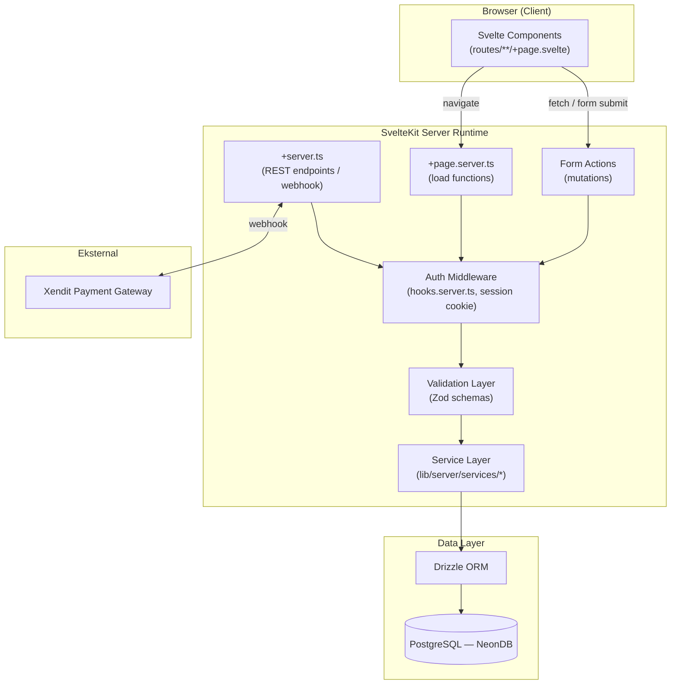
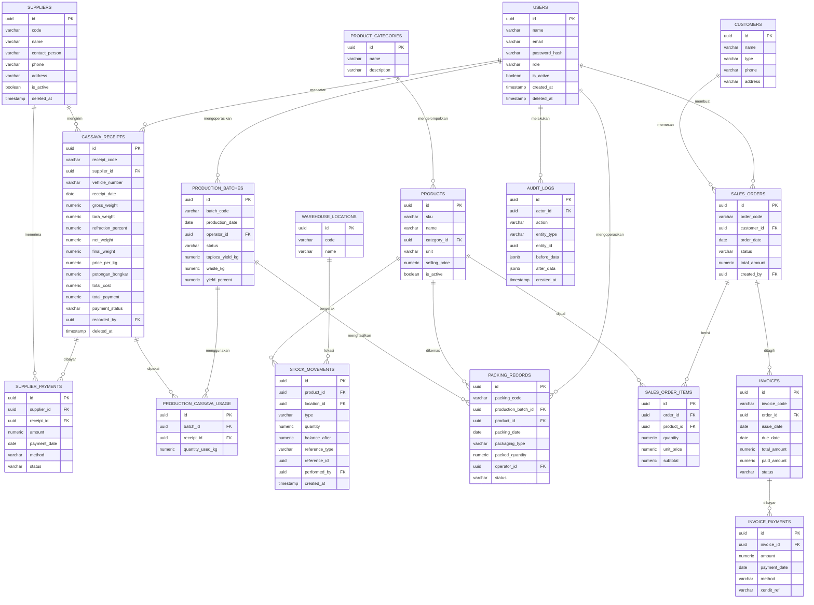
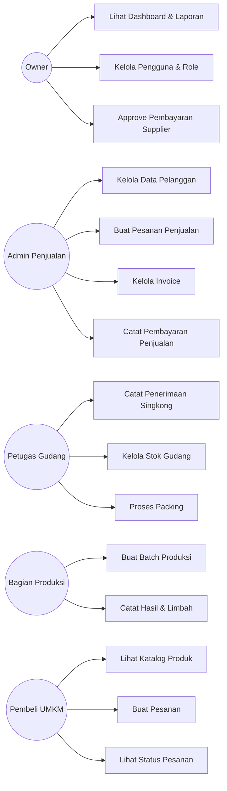
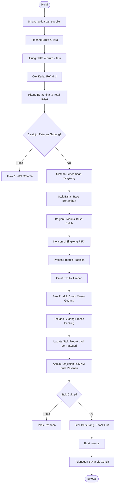
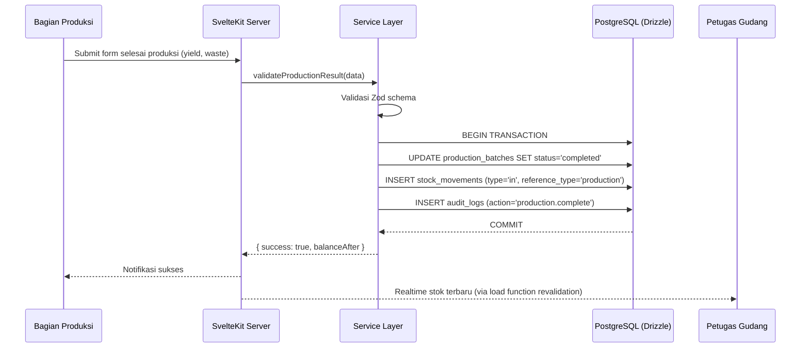

# Analisis dan Perancangan Sistem — CV TapioLeaf

**Sistem Manajemen Proses Bisnis Pabrik Tapioka**

Stack: SvelteKit (full-stack) · Drizzle ORM · PostgreSQL (NeonDB) · Zod · Argon2id

---

## Daftar Isi

1. [Pendahuluan](#1-pendahuluan)
2. [Analisis Proses Bisnis End-to-End](#2-analisis-proses-bisnis-end-to-end)
3. [Arsitektur Sistem](#3-arsitektur-sistem)
4. [Pemodelan Data (ERD)](#4-pemodelan-data-erd)
5. [Skema Database](#5-skema-database)
6. [Role-Based Access Control (RBAC)](#6-role-based-access-control-rbac)
7. [Use Case Diagram](#7-use-case-diagram)
8. [Activity Diagram](#8-activity-diagram)
9. [Workflow Diagram (Sequence)](#9-workflow-diagram-sequence)
10. [Desain REST API](#10-desain-rest-api)
11. [Struktur Halaman Frontend](#11-struktur-halaman-frontend)
12. [Dashboard & Reporting](#12-dashboard--reporting)
13. [Audit Log](#13-audit-log)
14. [Manajemen Stok (Event-Sourcing Ledger)](#14-manajemen-stok-event-sourcing-ledger)
15. [Kalkulasi Realtime](#15-kalkulasi-realtime)
16. [Integrasi Produksi → Gudang](#16-integrasi-produksi--gudang)
17. [Struktur Folder Proyek](#17-struktur-folder-proyek)
18. [Contoh Implementasi](#18-contoh-implementasi)
19. [Catatan Penutup](#19-catatan-penutup)

---

## 1. Pendahuluan

CV TapioLeaf adalah perusahaan pengolahan tepung tapioka yang berlokasi di Margoyoso, Pati, Jawa Tengah. Proses bisnis utama perusahaan mencakup penerimaan singkong dari supplier, proses produksi menjadi tepung tapioka, pengelolaan stok gudang, proses packing, dan penjualan ke pelanggan termasuk UMKM.

Dokumen ini berisi analisis proses bisnis dan rancangan teknis sistem yang mendukung lima peran pengguna:

| Role | Tanggung Jawab Utama |
|---|---|
| **Owner** | Akses penuh, melihat dashboard & laporan, approval pembayaran supplier |
| **Admin Penjualan** | Kelola pelanggan, pesanan, invoice, pembayaran penjualan |
| **Petugas Gudang** | Penerimaan singkong, stok gudang, proses packing |
| **Bagian Produksi** | Batch produksi, pencatatan hasil & limbah |
| **Pembeli UMKM** | Lihat katalog, buat pesanan, lihat status pesanan sendiri |

Rancangan ini bersifat konsisten dengan modul yang sudah dibangun sebelumnya (Autentikasi, Dashboard, Manajemen Produk, Stok Gudang, Produksi Harian, dan Penerimaan Singkong v1.1), dan berfungsi sebagai gambaran arsitektur sistem secara menyeluruh (system-wide view).

---

## 2. Analisis Proses Bisnis End-to-End

### 2.1 Alur Utama

```
Supplier → Penerimaan Singkong → Produksi → Gudang (Stok Mentah) → Packing → Kategorisasi → Penjualan → Pelanggan
```

### 2.2 Penjelasan Tahap per Tahap

**Tahap 1 — Penerimaan Singkong**
Singkong dari supplier ditimbang dua kali (bruto saat datang, tara saat kendaraan kosong/setelah bongkar). Petugas gudang mencatat nomor kendaraan, supplier, dan tanggal. Sistem otomatis menghitung netto, mengecek kadar refraksi (kualitas), lalu menghitung berat final dan total biaya — dikurangi `potongan bongkar` (biaya tenaga bongkar yang ditanggung supplier), sesuai kesepakatan harga per kg.

**Tahap 2 — Produksi**
Bagian Produksi membuka batch produksi baru, memilih sumber singkong (FIFO dari penerimaan yang belum terpakai penuh), memproses menjadi tepung tapioka. Hasil produksi (yield) dan limbah (waste) dicatat per batch, lalu stok tepung mentah hasil produksi otomatis masuk ke gudang.

**Tahap 3 — Gudang & Packing**
Stok hasil produksi dikemas sesuai jenis kemasan (karung 25kg, 50kg, dsb). Setiap proses packing mengonsumsi stok curah dan menghasilkan stok produk jadi per SKU/kategori, dengan update stok gudang secara atomik.

**Tahap 4 — Kategorisasi Produk**
Produk dikelompokkan berdasarkan kategori (Premium, Industrial, Food Grade) dan varian ukuran kemasan. Setiap kombinasi kategori + ukuran punya SKU sendiri untuk memudahkan pelacakan stok dan harga jual.

**Tahap 5 — Penjualan**
Admin Penjualan (atau Pembeli UMKM via katalog) membuat pesanan, sistem mengecek ketersediaan stok, menghasilkan invoice, dan mencatat status pembayaran. Stok berkurang otomatis saat pesanan dikonfirmasi (stock out).

### 2.3 Formula Bisnis Kunci

```
netWeight      = grossWeight - taraWeight
refractionCut  = netWeight × (refractionPercent / 100)
finalWeight    = netWeight - refractionCut
totalCost      = finalWeight × pricePerKg
totalPayment   = totalCost - potonganBongkar
```

> Catatan: `refractionPercent` direpresentasikan sebagai persentase kadar pengotor/kualitas singkong, konsisten dengan praktik umum perdagangan singkong dan dengan PRD Penerimaan Singkong v1.1 yang sudah ada (termasuk komponen `potongan bongkar`).

---

## 3. Arsitektur Sistem

### 3.1 Gaya Arsitektur

SvelteKit dipakai sebagai **full-stack framework** — satu codebase untuk UI (Svelte components + SSR) dan server logic (`+page.server.ts`, `+server.ts`), tanpa backend terpisah. Ini menyederhanakan deployment (single deploy ke Vercel) sekaligus menjaga type-safety end-to-end.



### 3.2 Lapisan Tanggung Jawab

| Layer | Tanggung Jawab |
|---|---|
| **Presentation** | Svelte components, form, tabel, chart (menggunakan `$state`/`$derived` runes untuk kalkulasi realtime) |
| **Routing/Server** | `+page.server.ts` (load + actions), `+server.ts` (REST API & webhook Xendit) |
| **Validation** | Zod schema — satu sumber kebenaran dipakai di client (preview) & server (enforcement) |
| **Service** | Business logic murni (hitung formula, validasi stok, FIFO consumption) — testable lewat Vitest |
| **Data Access** | Drizzle ORM — query builder type-safe, transaction (`db.transaction`) untuk operasi atomik |
| **Persistence** | PostgreSQL (NeonDB) |
| **Cross-cutting** | RBAC middleware, audit logging, session management (httpOnly cookie) |

---

## 4. Pemodelan Data (ERD)



---

## 5. Skema Database

Semua tabel menggunakan **UUID primary key** (`defaultRandom()`), kolom audit `created_at` / `updated_at`, dan **soft delete** (`deleted_at` nullable) kecuali tabel ledger murni (`stock_movements`, `audit_logs`) yang bersifat append-only.

| Tabel | Kolom Kunci | Keterangan |
|---|---|---|
| `users` | name, email (unique), password_hash (argon2id), role enum, is_active | Role: owner, admin_penjualan, petugas_gudang, bagian_produksi, pembeli_umkm |
| `sessions` | id, user_id FK, expires_at | Session-based auth, httpOnly cookie |
| `suppliers` | code (unique), name, contact_person, phone, address, is_active | |
| `cassava_receipts` | receipt_code (unique), supplier_id FK, vehicle_number, gross/tara/net/final_weight, refraction_percent, price_per_kg, potongan_bongkar, total_cost, total_payment, payment_status enum | Formula dihitung & disimpan (bukan view) untuk histori yang stabil |
| `supplier_payments` | supplier_id FK, receipt_id FK nullable, amount, payment_date, method, status | |
| `production_batches` | batch_code (unique), production_date, operator_id FK, status enum (planned/in_progress/completed/cancelled), tapioca_yield_kg, waste_kg, yield_percent | |
| `production_cassava_usage` | batch_id FK, receipt_id FK, quantity_used_kg | Junction table — pelacakan FIFO sumber singkong per batch |
| `product_categories` | name, description, parent_id FK nullable | Mendukung kategori hierarkis (mis. Tapioka > Food Grade > 25kg) |
| `products` | sku (unique), name, category_id FK, unit, selling_price, is_active | Stok aktual dihitung dari `stock_movements`, bukan kolom statis |
| `warehouse_locations` | code (unique), name, description | |
| `stock_movements` | product_id FK, location_id FK, type enum (in/out/adjustment/transfer), quantity, balance_after, reference_type enum (production/packing/sales/adjustment), reference_id, performed_by FK | **Append-only**, sumber kebenaran stok |
| `packing_records` | packing_code (unique), production_batch_id FK, product_id FK, packaging_type, packed_quantity, operator_id FK, status | Memicu `stock_movements` (out: curah, in: produk jadi) |
| `customers` | name, type enum (umkm/retail/corporate), phone, address, is_active | |
| `sales_orders` | order_code (unique), customer_id FK, order_date, status enum (draft/confirmed/fulfilled/cancelled), total_amount, created_by FK | |
| `sales_order_items` | order_id FK, product_id FK, quantity, unit_price, subtotal | |
| `invoices` | invoice_code (unique), order_id FK, issue_date, due_date, total_amount, paid_amount, status enum (unpaid/partial/paid/overdue) | |
| `invoice_payments` | invoice_id FK, amount, payment_date, method, xendit_ref | Terhubung ke webhook Xendit |
| `audit_logs` | actor_id FK, action, entity_type, entity_id, before_data jsonb, after_data jsonb | **Append-only**, dicatat di setiap mutasi sensitif |

---

## 6. Role-Based Access Control (RBAC)

| Modul / Aksi | Owner | Admin Penjualan | Petugas Gudang | Bagian Produksi | Pembeli UMKM |
|---|:---:|:---:|:---:|:---:|:---:|
| Dashboard & Laporan | Full | Sales only | Stok only | Produksi only | Pesanan sendiri |
| Supplier | Full | Read | Read | — | — |
| Penerimaan Singkong | Read | — | Create/Update | Read | — |
| Pembayaran Supplier | Approve | — | — | — | — |
| Produksi | Read | — | Read | Create/Update | — |
| Stok Gudang | Read | Read | Create/Update | Read | — |
| Packing | Read | — | Create/Update | — | — |
| Produk & Kategori | Full | Read | Read | Read | Read (katalog) |
| Pelanggan | Read | Create/Update | — | — | Profil sendiri |
| Pesanan Penjualan | Read | Create/Update | — | — | Create (sendiri) |
| Invoice & Pembayaran | Read | Create/Update | — | — | Read (sendiri) |
| Manajemen User | Full | — | — | — | — |
| Audit Log | Full | — | — | — | — |

Implementasi: middleware di `hooks.server.ts` membaca session → inject `event.locals.user` → setiap `+page.server.ts`/`+server.ts` memanggil helper `requireRole(['owner', 'petugas_gudang'])` sebelum eksekusi.

---

## 7. Use Case Diagram



---

## 8. Activity Diagram

Diagram berikut menggambarkan aktivitas end-to-end dari kedatangan singkong hingga pembayaran pelanggan.



---

## 9. Workflow Diagram (Sequence)

Contoh integrasi produksi → gudang secara atomik:



---

## 10. Desain REST API

SvelteKit menyediakan dua jenis endpoint: **form actions** (mutasi dari UI, progressive enhancement) dan **`+server.ts`** (REST API untuk AJAX, mobile, atau webhook eksternal seperti Xendit).

| Method | Endpoint | Deskripsi | Role |
|---|---|---|---|
| GET | `/api/v1/suppliers` | List supplier | Owner, Petugas Gudang |
| POST | `/api/v1/suppliers` | Tambah supplier | Owner |
| GET | `/api/v1/cassava-receipts` | List penerimaan singkong (filter tanggal/supplier) | Petugas Gudang, Owner |
| POST | `/api/v1/cassava-receipts` | Catat penerimaan baru (auto-calc) | Petugas Gudang |
| PATCH | `/api/v1/cassava-receipts/:id` | Update sebelum dikunci/diproduksi | Petugas Gudang |
| GET | `/api/v1/production-batches` | List batch produksi | Bagian Produksi, Owner |
| POST | `/api/v1/production-batches` | Buka batch baru | Bagian Produksi |
| PATCH | `/api/v1/production-batches/:id/complete` | Selesaikan batch (yield, waste) | Bagian Produksi |
| GET | `/api/v1/stock-movements` | Ledger stok (filter produk/lokasi) | Petugas Gudang, Owner |
| POST | `/api/v1/packing-records` | Catat packing (trigger stock movement) | Petugas Gudang |
| GET | `/api/v1/products` | List produk + kategori + stok terkini | Semua role (read scope berbeda) |
| POST | `/api/v1/products` | Tambah produk/SKU | Owner |
| GET | `/api/v1/customers` | List pelanggan | Admin Penjualan, Owner |
| POST | `/api/v1/sales-orders` | Buat pesanan | Admin Penjualan, Pembeli UMKM |
| GET | `/api/v1/sales-orders/:id` | Detail pesanan + item | Pemilik pesanan, Admin, Owner |
| POST | `/api/v1/invoices` | Generate invoice dari pesanan | Admin Penjualan |
| POST | `/api/v1/invoices/:id/pay` | Catat pembayaran manual | Admin Penjualan |
| POST | `/api/webhooks/xendit` | Callback status pembayaran Xendit | Sistem (signature-verified) |
| GET | `/api/v1/dashboard/summary` | Ringkasan KPI sesuai role | Semua role |
| GET | `/api/v1/audit-logs` | List audit trail | Owner |

Konvensi: semua endpoint mutasi (`POST`/`PATCH`/`DELETE`) divalidasi dengan Zod schema yang sama dengan yang dipakai di form client, dibungkus `db.transaction()` jika menyentuh lebih dari satu tabel, dan otomatis menulis ke `audit_logs`.

---

## 11. Struktur Halaman Frontend

```
src/routes/
├── (auth)/
│   ├── login/+page.svelte
│   └── logout/+server.ts
├── (app)/
│   ├── dashboard/+page.svelte                 # KPI sesuai role
│   ├── suppliers/
│   │   ├── +page.svelte                       # list
│   │   └── [id]/+page.svelte                  # detail + histori
│   ├── cassava-receipts/
│   │   ├── +page.svelte                       # list & filter
│   │   └── new/+page.svelte                   # form realtime calc
│   ├── production/
│   │   ├── +page.svelte                       # list batch
│   │   └── [id]/+page.svelte                  # detail & complete form
│   ├── warehouse/
│   │   ├── stock/+page.svelte                 # stok per produk/lokasi
│   │   └── movements/+page.svelte             # ledger stok
│   ├── packing/+page.svelte
│   ├── products/
│   │   ├── +page.svelte
│   │   └── categories/+page.svelte
│   ├── customers/+page.svelte
│   ├── sales/
│   │   ├── orders/+page.svelte
│   │   ├── orders/new/+page.svelte
│   │   └── invoices/+page.svelte
│   ├── catalog/+page.svelte                    # khusus Pembeli UMKM
│   ├── my-orders/+page.svelte                  # khusus Pembeli UMKM
│   ├── reports/+page.svelte
│   ├── users/+page.svelte                      # khusus Owner
│   └── audit-logs/+page.svelte                 # khusus Owner
└── api/
    ├── v1/.../+server.ts
    └── webhooks/xendit/+server.ts
```

Setiap grup route `(app)` dilindungi oleh `+layout.server.ts` yang mengecek session & role, dan menyembunyikan menu navigasi sesuai izin.

---

## 12. Dashboard & Reporting

| Role | Widget Utama |
|---|---|
| Owner | Revenue trend, nilai stok keseluruhan, outstanding pembayaran supplier, yield produksi rata-rata, top customer |
| Admin Penjualan | Pesanan pending, invoice belum dibayar, penjualan per kategori produk |
| Petugas Gudang | Stok per lokasi, ambang batas stok rendah, riwayat penerimaan singkong harian |
| Bagian Produksi | Batch aktif, yield % per batch, tren limbah produksi |
| Pembeli UMKM | Status pesanan terbaru, riwayat transaksi |

Implementasi: query agregasi via Drizzle (`sql` template + `groupBy`) di-cache singkat (mis. revalidate tiap load), divisualisasikan dengan chart (mis. layer-chart atau Chart.js) di komponen Svelte.

---

## 13. Audit Log

- Ditulis pada setiap mutasi sensitif: penerimaan singkong, pembayaran, perubahan stok, perubahan harga, perubahan role user.
- Struktur: `actor_id`, `action` (mis. `cassava_receipt.create`), `entity_type`, `entity_id`, `before_data`/`after_data` (JSONB snapshot parsial), `created_at`.
- Bersifat **append-only** — tidak ada update/delete pada tabel ini.
- Hanya bisa dibaca oleh role **Owner**, ditampilkan dengan filter tanggal/actor/modul.

---

## 14. Manajemen Stok (Event-Sourcing Ledger)

Stok **tidak pernah diupdate langsung**. Setiap perubahan stok dicatat sebagai baris baru di `stock_movements` (`type`: in/out/adjustment/transfer), dan stok terkini dihitung sebagai jumlah kumulatif (atau dicache di kolom `balance_after` pada baris terakhir untuk pembacaan cepat).

Keuntungan pola ini:
- Histori stok dapat ditelusuri penuh per produk/lokasi/waktu.
- Rekonsiliasi lebih mudah saat ada selisih stok fisik vs sistem.
- Setiap movement punya `reference_type` + `reference_id`, sehingga bisa dilacak balik ke dokumen sumber (batch produksi, packing, atau pesanan penjualan tertentu).

---

## 15. Kalkulasi Realtime

Form penerimaan singkong menggunakan Svelte 5 runes (`$state`, `$derived`) agar `netWeight`, `finalWeight`, dan `totalPayment` ter-update otomatis saat user mengetik, **tanpa submit**:

```ts
let grossWeight = $state(0);
let taraWeight = $state(0);
let refractionPercent = $state(0);
let pricePerKg = $state(0);
let potonganBongkar = $state(0);

let netWeight = $derived(grossWeight - taraWeight);
let refractionCut = $derived(netWeight * (refractionPercent / 100));
let finalWeight = $derived(netWeight - refractionCut);
let totalCost = $derived(finalWeight * pricePerKg);
let totalPayment = $derived(totalCost - potonganBongkar);
```

Kalkulasi yang sama **divalidasi ulang di server** (dalam service layer, menggunakan Zod schema + fungsi murni yang sama) sebelum disimpan — mencegah manipulasi nilai dari client.

---

## 16. Integrasi Produksi → Gudang

1. Bagian Produksi menutup batch (`status: completed`) dengan input `tapioca_yield_kg` dan `waste_kg`.
2. Service layer menjalankan `db.transaction()`:
   - Update `production_batches`.
   - Insert `stock_movements` (`type: in`, `reference_type: production`, `reference_id: batch.id`).
   - Insert `audit_logs`.
3. Jika salah satu langkah gagal, seluruh transaksi di-rollback (atomicity) — stok tidak akan "bertambah sebagian".
4. Petugas Gudang langsung melihat stok baru lewat `load` function yang me-revalidate data tanpa refresh manual.

---

## 17. Struktur Folder Proyek

```
tapioleaf/
├── src/
│   ├── lib/
│   │   ├── server/
│   │   │   ├── db/
│   │   │   │   ├── schema/              # Drizzle schema per domain
│   │   │   │   │   ├── users.ts
│   │   │   │   │   ├── suppliers.ts
│   │   │   │   │   ├── cassava-receipts.ts
│   │   │   │   │   ├── production.ts
│   │   │   │   │   ├── warehouse.ts
│   │   │   │   │   ├── products.ts
│   │   │   │   │   ├── sales.ts
│   │   │   │   │   └── audit-logs.ts
│   │   │   │   ├── index.ts             # drizzle() client init
│   │   │   │   └── migrations/
│   │   │   ├── services/                # business logic murni
│   │   │   │   ├── cassava-receipt.service.ts
│   │   │   │   ├── production.service.ts
│   │   │   │   ├── stock.service.ts
│   │   │   │   └── sales.service.ts
│   │   │   ├── auth/
│   │   │   │   ├── session.ts
│   │   │   │   └── rbac.ts
│   │   │   └── audit.ts
│   │   ├── validations/                 # Zod schema (shared client+server)
│   │   │   ├── cassava-receipt.schema.ts
│   │   │   └── production.schema.ts
│   │   └── components/
│   │       ├── ui/                      # shadcn-svelte-style primitives
│   │       └── forms/
│   ├── routes/                          # lihat bagian 11
│   └── hooks.server.ts                  # auth + RBAC middleware
├── drizzle.config.ts
├── tests/
│   ├── unit/                            # Vitest
│   └── e2e/                             # Playwright
└── package.json
```

---

## 18. Contoh Implementasi

**Drizzle schema — `cassava-receipts.ts`**

```ts
import { pgTable, uuid, varchar, numeric, date, timestamp } from 'drizzle-orm/pg-core';
import { suppliers } from './suppliers';
import { users } from './users';

export const cassavaReceipts = pgTable('cassava_receipts', {
  id: uuid('id').primaryKey().defaultRandom(),
  receiptCode: varchar('receipt_code', { length: 50 }).notNull().unique(),
  supplierId: uuid('supplier_id').notNull().references(() => suppliers.id),
  vehicleNumber: varchar('vehicle_number', { length: 20 }).notNull(),
  receiptDate: date('receipt_date').notNull(),
  grossWeight: numeric('gross_weight', { precision: 10, scale: 2 }).notNull(),
  taraWeight: numeric('tara_weight', { precision: 10, scale: 2 }).notNull(),
  refractionPercent: numeric('refraction_percent', { precision: 5, scale: 2 }).notNull(),
  netWeight: numeric('net_weight', { precision: 10, scale: 2 }).notNull(),
  finalWeight: numeric('final_weight', { precision: 10, scale: 2 }).notNull(),
  pricePerKg: numeric('price_per_kg', { precision: 10, scale: 2 }).notNull(),
  potonganBongkar: numeric('potongan_bongkar', { precision: 10, scale: 2 }).default('0'),
  totalCost: numeric('total_cost', { precision: 12, scale: 2 }).notNull(),
  totalPayment: numeric('total_payment', { precision: 12, scale: 2 }).notNull(),
  paymentStatus: varchar('payment_status', { length: 20 }).default('unpaid'),
  recordedBy: uuid('recorded_by').notNull().references(() => users.id),
  createdAt: timestamp('created_at').defaultNow(),
  deletedAt: timestamp('deleted_at'),
});
```

**Zod validation schema**

```ts
import { z } from 'zod';

export const cassavaReceiptSchema = z.object({
  supplierId: z.string().uuid(),
  vehicleNumber: z.string().min(1).max(20),
  receiptDate: z.coerce.date(),
  grossWeight: z.number().positive(),
  taraWeight: z.number().nonnegative(),
  refractionPercent: z.number().min(0).max(100),
  pricePerKg: z.number().positive(),
  potonganBongkar: z.number().nonnegative().default(0),
}).refine((d) => d.taraWeight < d.grossWeight, {
  message: 'Tara weight harus lebih kecil dari gross weight',
  path: ['taraWeight'],
});
```

**Service layer — kalkulasi & transaksi atomik**

```ts
// lib/server/services/cassava-receipt.service.ts
import { db } from '$lib/server/db';
import { cassavaReceipts } from '$lib/server/db/schema/cassava-receipts';
import { auditLogs } from '$lib/server/db/schema/audit-logs';
import type { CassavaReceiptInput } from '$lib/validations/cassava-receipt.schema';

export async function createCassavaReceipt(input: CassavaReceiptInput, actorId: string) {
  const netWeight = input.grossWeight - input.taraWeight;
  const refractionCut = netWeight * (input.refractionPercent / 100);
  const finalWeight = netWeight - refractionCut;
  const totalCost = finalWeight * input.pricePerKg;
  const totalPayment = totalCost - input.potonganBongkar;

  return await db.transaction(async (tx) => {
    const [receipt] = await tx.insert(cassavaReceipts).values({
      ...input,
      netWeight: netWeight.toFixed(2),
      finalWeight: finalWeight.toFixed(2),
      totalCost: totalCost.toFixed(2),
      totalPayment: totalPayment.toFixed(2),
    }).returning();

    await tx.insert(auditLogs).values({
      actorId,
      action: 'cassava_receipt.create',
      entityType: 'cassava_receipts',
      entityId: receipt.id,
      afterData: receipt,
    });

    return receipt;
  });
}
```

**Form action — `cassava-receipts/new/+page.server.ts`**

```ts
import { fail } from '@sveltejs/kit';
import { cassavaReceiptSchema } from '$lib/validations/cassava-receipt.schema';
import { createCassavaReceipt } from '$lib/server/services/cassava-receipt.service';
import { requireRole } from '$lib/server/auth/rbac';

export const actions = {
  default: async ({ request, locals }) => {
    requireRole(locals.user, ['petugas_gudang']);
    const formData = Object.fromEntries(await request.formData());
    const parsed = cassavaReceiptSchema.safeParse(formData);

    if (!parsed.success) {
      return fail(400, { errors: parsed.error.flatten() });
    }

    const receipt = await createCassavaReceipt(parsed.data, locals.user.id);
    return { success: true, receipt };
  },
};
```

---

## 19. Catatan Penutup

Rancangan ini menyatukan seluruh modul (Supplier, Penerimaan Singkong, Produksi, Gudang, Produk, Packing, Penjualan) ke dalam satu arsitektur SvelteKit + Drizzle + PostgreSQL yang konsisten dengan PRD per-fitur yang sudah dibuat sebelumnya. Beberapa rekomendasi lanjutan:

- **Materialized stock view**: pertimbangkan view/kolom cache `current_stock` per produk agar query dashboard tidak selalu menghitung ulang dari seluruh ledger.
- **Idempotency key** pada endpoint webhook Xendit untuk mencegah duplikasi pembayaran saat retry.
- **Index** pada kolom yang sering difilter: `cassava_receipts.receipt_date`, `stock_movements.product_id + created_at`, `sales_orders.status`.
- Dokumen ini cocok dipakai sebagai dasar Bab III (Analisis dan Perancangan Sistem) pada skripsi, dilengkapi dengan diagram pada bagian 4, 7, 8, dan 9.
